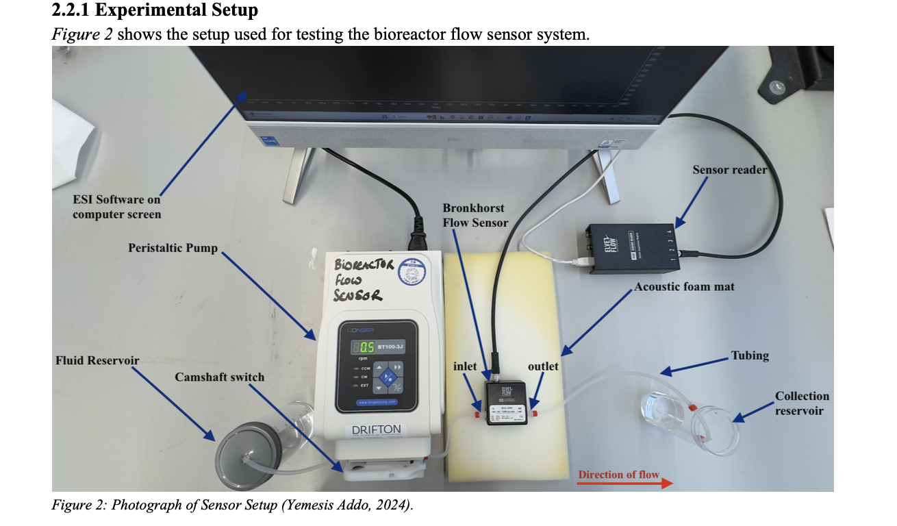
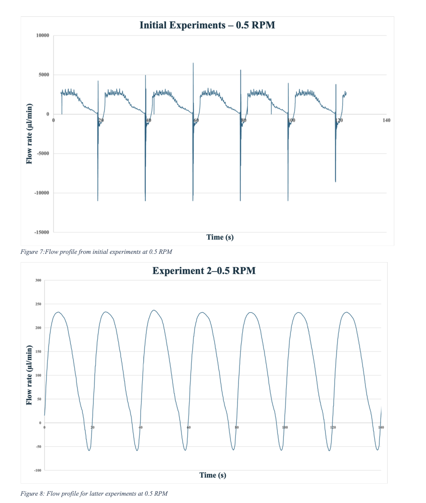
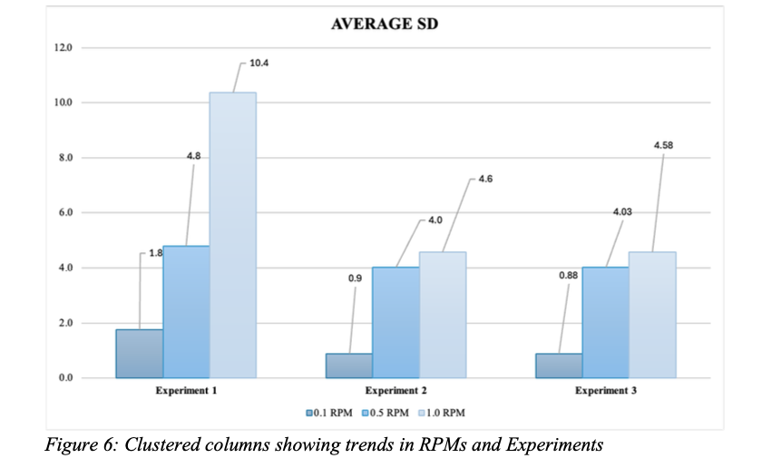

# Precision Nutrient Delivery for Tissue Engineering Bioreactors

## Overview

Final-year integrated design project investigating the integration and optimisation of an in-line flow sensor for real-time flow monitoring within a perfusion bioreactor system for bone tissue engineering.

## Project Aim

The project focused on improving the reliability and accuracy of real-time flow monitoring within a perfusion bioreactor, with the aim of supporting more precise nutrient delivery during bone tissue engineering.

## My Work

I focused on the integration and optimisation of the flow-sensing system. This involved:

- Designing and conducting 80+ experiments
- Calibrating and evaluating the in-line flow sensor
- Investigating the effects of tubing diameter, pump occlusion and mechanical vibration on sensor measurements
- Collecting and analysing experimental data
- Identifying sources of measurement error and inconsistency
- Optimising sensor and system settings to improve measurement reliability
## Project Visuals

### Experimental Setup

The experimental setup used to test the in-line flow sensor within the perfusion bioreactor system.

### Flow Sensor Optimisation

Comparison of flow profiles before and after optimisation, showing improved stability and reduced signal distortion following sensor and system configuration adjustments.

### Experimental Results

Average standard deviation across experimental conditions, showing the improvement in measurement precision across the experiments.

## Key Findings

The project demonstrated that specific system configurations improved flow measurement accuracy and reproducibility. Optimising the tubing configuration, pump occlusion level and vibration damping significantly improved sensor performance.

## Outcome

The optimised configuration improved real-time flow measurement accuracy by approximately 20%.

## Skills & Methods

- Experimental design
- Data collection and analysis
- Sensor calibration and validation
- Experimental optimisation
- Troubleshooting
- Quantitative analysis
- Biomedical instrumentation
- Tissue engineering
- Technical report writing

## Tools & Equipment

- In-line flow sensor
- Perfusion bioreactor
- Experimental measurement equipment
- Microsoft Excel

## Project Materials

- [View Project Report](./precision-nutrient-delivery-bioreactor-report.pdf)
- [View Project Presentation](./precision-nutrient-delivery-project-presentation.pdf)

## Academic Project

Queen Mary University of London  
BEng Biomedical Engineering  
2024–2025
